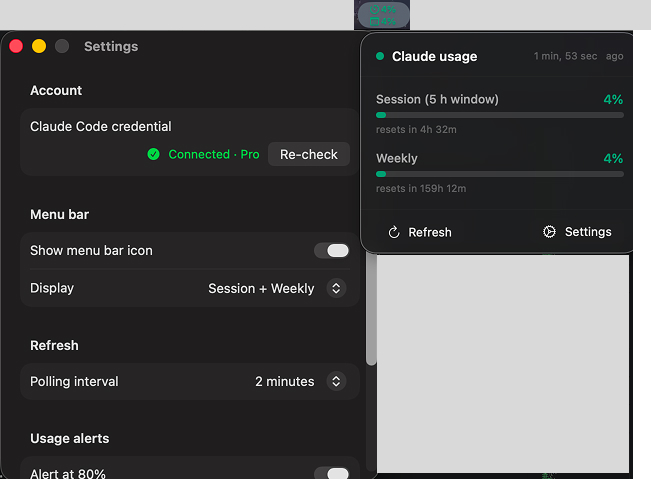

# ClaudeUsage



A macOS menu-bar app that shows your Claude subscription usage (5-hour session %
and 7-day weekly %) with Liquid Glass styling (macOS 26). macOS-only.

---

## ⚠️ Terms-of-Service notice — read this first

**This app is for personal use only and is not compliant with Anthropic's
Consumer Terms of Service. Do not distribute or share it.**

It works by reusing the OAuth token that Claude Code stores on your machine and
calling the Anthropic API on your behalf to read usage. Anthropic's policy is
explicit that subscription (Free/Pro/Max/Team/Enterprise) OAuth credentials are
"intended exclusively… to support ordinary use of Claude Code and other native
Anthropic applications," and that third-party apps may not route requests
through those credentials. There is **no sanctioned API** for subscription
usage data (a Console API key bills separately and does not expose your Pro/Max
quota), so there is no compliant way to build exactly this.

Practical implications:
- Use it only on your own machine, with your own account. Never ship it.
- Anthropic began technically rejecting subscription OAuth tokens from
  non–Claude-Code clients in early 2026; this app may stop working at any time.
- If you want this functionality on firm footing, ask Anthropic
  (contact sales) about a permitted method, or use Claude Code's own `/usage`.

This is documented honestly rather than hidden. Proceed at your own discretion.

---

## How it works

- **Auth:** reads Claude Code's OAuth token from the login keychain (item
  `Claude Code-credentials`). No in-app login. The app holds no credential of
  its own and never stores or transmits the token anywhere except the Anthropic
  API request.
- **Per device:** it shows the usage of whatever account is signed into
  `claude` (Claude Code) on that machine.
- **Fetch:** every 60 s (configurable) it sends a minimal 1-token
  `POST /v1/messages` request (`anthropic-beta: oauth-2025-04-20`) and reads
  usage from the response headers:
  `anthropic-ratelimit-unified-5h-utilization` / `-7d-utilization` (fractions)
  and the matching `-5h-reset` / `-7d-reset` epochs. This is the same technique
  established Claude usage monitors use, and is more durable than the
  undocumented `/api/oauth/usage` endpoint.
- **Unsandboxed** so it can read Claude Code's login-keychain item.

---

## Project structure

```
ClaudeUsage/
├── project.yml              — XcodeGen spec (the .xcodeproj is generated)
├── Shared/
│   ├── Theme.swift          — Liquid Glass modifier + UsageBar + colour helpers
│   ├── AuthManager.swift    — reads Claude Code's keychain OAuth token
│   └── UsageStore.swift     — @Observable store + UsagePoller (headers method)
│
├── ClaudeUsage/             — macOS menu-bar target (unsandboxed)
│   ├── ClaudeUsageApp.swift — MenuBarExtra + Settings window
│   ├── PopoverView.swift    — Liquid Glass usage panel
│   ├── SettingsView.swift   — native grouped Form: account, interval, alerts, quit
│   ├── Assets.xcassets      — UsageGreen/Amber/Red, AccentColor, AppIcon
│   └── ClaudeUsage.entitlements
│
├── Scripts/build.sh         — regenerate project → archive → export → dmg
└── ExportOptions.plist      — Personal Team export config
```

---

## Build & run

`make` lists every task. The common ones:

```bash
make run        # run the cross-platform app
make check      # fmt + clippy + tests
make bundle     # macOS .app and .dmg
make poll       # one live usage poll, no GUI
```

> **Two apps live here during the port.** The cross-platform Rust/Tauri app in
> `crates/` is the direction of travel; the original Swift app is still the
> macOS reference until the Xcode project is retired. Swift-specific tasks are
> prefixed `swift-` (`make swift-build`, `make swift-open`).
> See [docs/cross-platform.md](docs/cross-platform.md).

### The Swift app

The `.xcodeproj` is generated from `project.yml` (not committed).

```bash
# one time
brew install xcodegen
# then
make swift-open       # regenerates the project and opens Xcode
make swift-build      # or build a DMG
```

Requirements: Xcode 26, macOS 26. Set your Personal Team ID in `project.yml`
(`DEVELOPMENT_TEAM`) if signing doesn't resolve automatically.

For the DMG pipeline:

```bash
brew install node graphicsmagick imagemagick
npm install --global create-dmg
./Scripts/build.sh
xattr -rd com.apple.quarantine /Applications/ClaudeUsage.app   # first launch
```

---

## Keychain access — stopping the password prompt

On first launch (and occasionally after) macOS shows:

> **"ClaudeUsage" wants to use your confidential information stored in
> "Claude Code-credentials" in your keychain.**

This is expected and **not** a bug. The app reads Claude Code's OAuth token,
which the `claude` CLI stores as a login-keychain item. macOS guards every
keychain item with an access-control list (ACL) that, by default, lists only
the app that created it (the `claude` CLI). When ClaudeUsage — a different
binary — reads the item, macOS asks you to authorize it.

**Fix: click "Always Allow" (not just "Allow") and enter your password once.**
That adds ClaudeUsage to the item's ACL permanently, and you won't be prompted
on future launches.

You can also pre-authorize it manually without waiting for the dialog:
open **Keychain Access → search `Claude Code-credentials` → double-click → the
"Access Control" tab → add `/Applications/ClaudeUsage.app`** to the allowed
list.

**Caveat — the prompt can return after a token refresh.** When your OAuth token
auto-refreshes, the `claude` CLI deletes and re-creates the keychain item; the
new item's ACL again lists only the CLI, so you'll be prompted once more. Click
"Always Allow" again. This is infrequent (it tracks token refresh, not the
60-second poll cycle — the app caches the token in memory between polls, so
routine polling never prompts).

**Why there's no code fix.** On this setup the token lives *only* in the
keychain — there is no plaintext `~/.claude/.credentials.json` to read instead
(`~/.claude.json` holds account metadata, not the token). The ACL prompt is the
keychain's security model working as designed; no app-side change can bypass it
without weakening that protection. "Always Allow" is the supported answer, and
it is a local-machine authorization only — it changes nothing about the app's
Terms-of-Service standing (see the ToS notice above).

---

## Data flow

```
Claude Code (claude CLI) login  →  keychain item "Claude Code-credentials"
        │
        ▼
AuthManager.accessToken
        │
        ▼
UsagePoller (60 s)  →  POST api.anthropic.com/v1/messages (1 token)
        │                 read anthropic-ratelimit-unified-5h/7d-* headers
        ▼
UsageStore (@Observable)  →  MenuBarLabel + PopoverView
```

---

## Why macOS-only (no iOS / widget)

An iOS widget would need the Mac's usage values synced to the phone, since
App Groups are per-device. The only viable sync (iCloud key-value store)
**requires a paid Apple Developer account** — a free Personal Team cannot use
the iCloud capability (Apple's tooling rejects it outright). With the
free-Apple-ID constraint this project is built on, there's no path to a working
iPhone widget, so the iOS app and widget were removed. The Mac menu-bar app is
the deliverable.

---

## Known gaps

- **App icons** are placeholder slots.
- **Durability:** built on an undocumented/unsanctioned path (see the ToS notice).

---

## Sources

- Headers technique + keychain token reuse: established Claude usage monitors
  (e.g. github.com/CrocSwap/claude-meter, github.com/rjwalters/claude-monitor)
- Anthropic OAuth/credential policy: anthropic.com/legal/consumer-terms,
  code.claude.com/docs/en/authentication
- Liquid Glass API: developer.apple.com (WWDC 2025)
